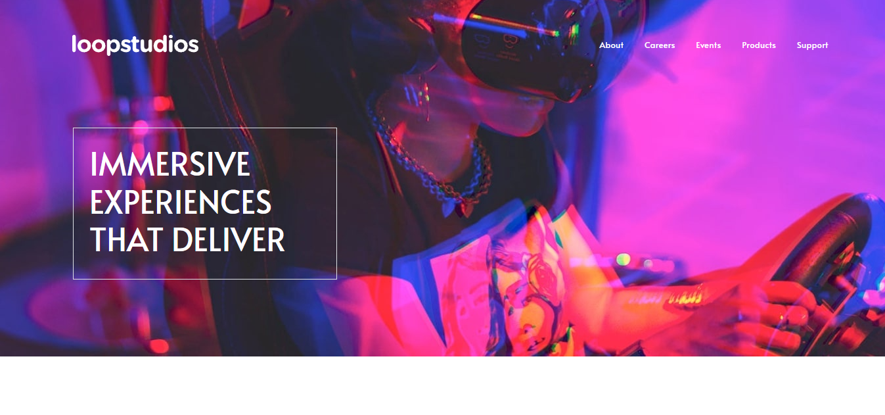

# Frontend Mentor - Loopstudios landing page solution

This is a solution to the [Product preview card component challenge on Frontend Mentor](https://www.frontendmentor.io/challenges/product-preview-card-component-GO7UmttRfa). Frontend Mentor challenges help you improve your coding skills by building realistic projects. 

## Table of contents

- [Overview](#overview)
  - [The challenge](#the-challenge)
  - [Screenshot](#screenshot)
  - [Links](#links)
- [My process](#my-process)
  - [Built with](#built-with)
  - [What I learned](#what-i-learned)
  - [Continued development](#continued-development)
  - [Useful resources](#useful-resources)
- [Author](#author)
- [Acknowledgments](#acknowledgments)

**Note: Delete this note and update the table of contents based on what sections you keep.**

## Overview

### The challenge

Users should be able to:

- View the optimal layout depending on their device's screen size
- See hover and focus states for interactive elements

### Screenshot

### Links

- Solution URL: 
- Live Site URL: [https://fm-loopstudios-landing-three.vercel.app/](https://fm-loopstudios-landing-three.vercel.app/)

## My process

### Built with

- Semantic HTML5 markup
- CSS custom properties
- CSS Grid
- [Bootstrap](https://https://getbootstrap.com/) - CSS Framework

### What I learned

This project teaches me how to use bootstrap and how to use it to make a responsive website.
Additionally, the use of media queries, CSS Grid and also the design workflows.
## Author

- Github - [@tinsaye-simeneh](https://github.com/tinsaye-simeneh)
- Frontend Mentor - [@tinsaye-simeneh](https://www.frontendmentor.io/profile/tinsaye-simeneh)

